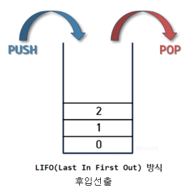

# 스택

## 개념

- 가장 나중에 넣은 데이터를 가장 먼저 빼낼 수 있는 데이터 구조로 Last In First Out(LIFO)방식 or (First In Last Out)
  
- 실생활에서 예로들면 브라우저의 기능중 뒤로가기 기능에서 스택이 사용이된다. 여러 브라우저를 돌아다니면 들어갔었던 사이트의 정보가 스택형식으로 쌓이는데 여기서 뒤로가기버튼을 누르면 가장최근에 들어왔던 페이지, 즉 현재 페이지를 제거하는것이므로 스택의 개념이 이용된다.

## 사용법

a_list.append(1): 괄호 안의 요소를 리스트 맨 뒤에 넣음

```
a_list = [1,2,3]
a_list.append(1)
=> [1,2,3,1]
```

a_list.pop():리스트의 맨 뒤에 요소를 꺼내고 리스트에서 삭제

```
a_list = [1,2,3]
a_list.pop()
=> [1,2]

print(a_list.pop())
출력: 2
a_list : [1]
```

### 참고

- [리스트활용](https://gorokke.tistory.com/129?category=939716)
- [스택실생활적용](https://monsieursongsong.tistory.com/4)
